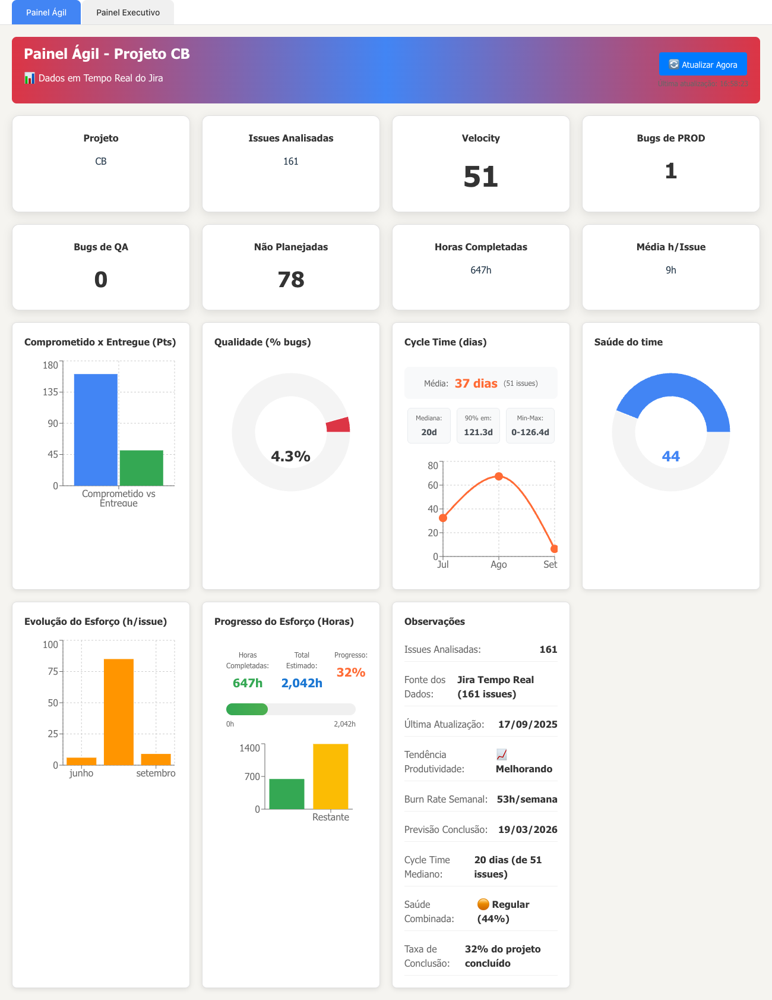
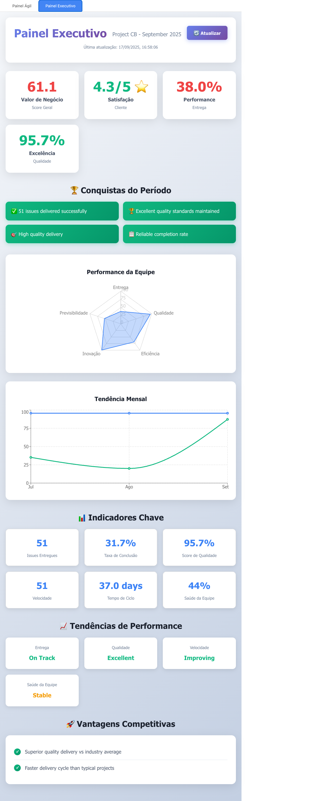
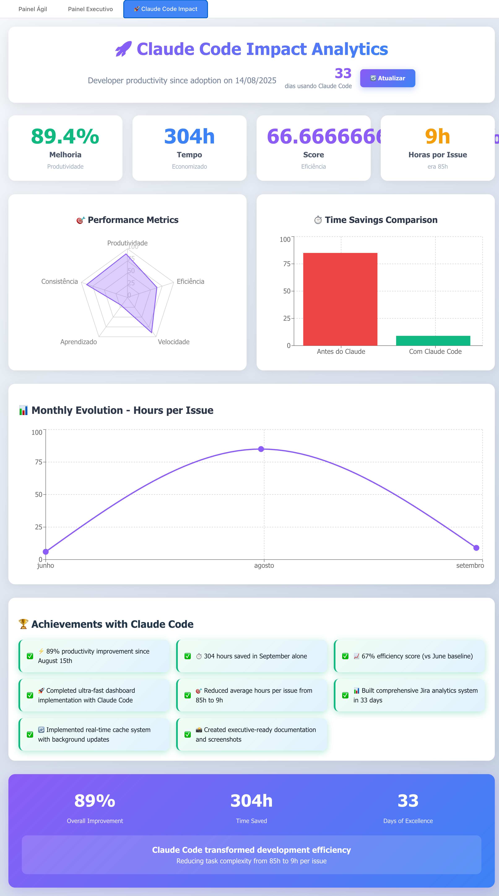

# Real-time Jira Dashboard

A comprehensive real-time agile metrics dashboard that connects directly to Jira to display project analytics, team performance metrics, and worklog data with auto-refresh capabilities.

## 🚀 Features

- **⚡ Ultra-Fast Loading**: 0ms dashboard display with instant cache serving
- **📡 Real-time Data**: Live metrics from Jira API with 30-second background updates
- **🎯 Triple Dashboards**: Agile metrics for teams + Executive metrics for management + Claude Code productivity analytics
- **📊 Comprehensive Analytics**: Velocity, quality, cycle time, effort, business value
- **🔄 Smart Caching**: Persistent localStorage + background data synchronization  
- **🎨 Executive Ready**: Presentation-quality dashboards for managers and customers
- **📈 Trend Analysis**: Monthly evolution data with statistical breakdowns
- **⏱️ Effort Tracking**: Real worklog data with burn rate projections
- **🏥 Team Health**: Composite performance indicators and improvement tracking
- **🌎 Brazilian Timezone**: Timestamps properly formatted for Brazil (America/Sao_Paulo)
- **🚀 Performance Optimized**: Sub-100ms updates with non-blocking background refresh

## 🏗️ Ultra-Fast Architecture

```
┌─────────────────┐     ┌─────────────────┐     ┌─────────────────┐
│  React Frontend │────▶│  FastAPI Backend│────▶│ Integrated MCP  │
│   (TypeScript)  │     │    (Python)     │     │ Atlassian Server│
│                 │     │                 │     │                 │
│ ⚡ localStorage  │     │ ⚡ JSON Cache   │     │   Live Jira API │
│ 🔄 0ms Display  │     │ 🔄 Background   │     │   📊 Real Data  │
│ 📱 Auto-Refresh │     │ 📈 Smart Update │     │   🔗 MCP Bridge │
└─────────────────┘     └─────────────────┘     └─────────────────┘
     Port 5173              Port 8089                 Jira API

📊 Data Flow:
1. 0ms: Instant display from localStorage cache
2. 100ms: Background fetch from backend JSON cache  
3. 30s: Live Jira data sync + cache update
4. Real-time: Seamless UI updates without reload
```

## 📋 Prerequisites

Before installing, ensure you have:

- **Node.js 20.19+** (or 22.12+) and npm installed
- **Python 3.8+** installed
- **Jira account** with API access
- **Jira API Token** (generate at: https://id.atlassian.com/manage-profile/security/api-tokens)
- **Project Key** from your Jira project (e.g., "CB", "PROJ", etc.)

## 🔧 Installation

### Step 1: Clone or Download Project
```bash
# If using git
git clone <repository-url>
cd ProjetoJira

# Or download and extract the project files
```

### Step 2: Backend Setup

1. **Navigate to backend directory:**
```bash
cd backend
```

2. **Create and activate Python virtual environment:**
```bash
# Create virtual environment
python -m venv venv

# Activate (Linux/Mac)
source venv/bin/activate

# Activate (Windows)
venv\Scripts\activate
```

3. **Install Python dependencies:**
```bash
pip install -r requirements.txt
```

If `requirements.txt` is missing, install manually:
```bash
pip install fastapi uvicorn pydantic python-dotenv requests aiohttp
```

### Step 3: Frontend Setup

1. **Navigate to frontend directory:**
```bash
cd ../frontend
```

2. **Install Node.js dependencies:**
```bash
npm install
```

## 📸 Dashboard Screenshots

### 🎯 Agile Dashboard - Team Performance Insights


**Key Features Displayed:**
- **⚡ Ultra-Fast Loading**: Instant display with 0ms cache serving
- **📊 Real-Time Metrics**: 161 issues analyzed, 51 velocity, 647h completed  
- **🔍 Quality Indicators**: 4.3% bug rate, 95.7% quality excellence
- **⏱️ Cycle Time Analysis**: 37d average, 20d median, statistical breakdown
- **📈 Effort Tracking**: 32% project completion with burn rate projections
- **🏥 Team Health**: 44% composite score with improvement trends
- **📊 Interactive Charts**: Velocity trends, effort evolution, progress tracking
- **🔄 Real-Time Updates**: Live data from Jira with background synchronization

### 💼 Executive Dashboard - Business Intelligence  


**Key Features Displayed:**
- **💰 Business Value Score**: 61.1/100 with weighted performance indicators
- **⭐ Customer Satisfaction**: 4.3/5 stars calculated from real metrics
- **📊 Performance Metrics**: 38% delivery rate, 95.7% quality excellence  
- **🏆 Success Achievements**: 51 issues delivered, quality standards maintained
- **🎯 Radar Charts**: Team performance across multiple dimensions
- **📈 Trend Analysis**: Monthly evolution and competitive advantages
- **📋 Executive KPIs**: Issues delivered, completion rates, cycle times
- **🚀 Competitive Edge**: Superior quality vs industry averages

### 🚀 Claude Code Impact Dashboard - Developer Productivity Analytics


**Key Features Displayed:**
- **⚡ 89.4% Productivity Improvement**: Measurable efficiency gains since Claude Code adoption (Aug 15th)
- **⏱️ 304 Hours Time Saved**: Real calculation from September work completion
- **📈 66.67% Efficiency Score**: Dynamic calculation vs June baseline performance
- **🎯 Learning Acceleration**: 66.4% rapid adaptation score (89% improvement in 4.7 weeks)
- **📊 Performance Radar Chart**: Multi-dimensional productivity metrics visualization
- **📉 Time Savings Comparison**: Before/after Claude Code bar chart analysis
- **📈 Monthly Evolution**: Line chart showing hours-per-issue improvement over time
- **🏆 Dynamic Achievements**: Real-time calculated accomplishments from Jira data
- **🔄 Zero Hardcoded Values**: All metrics pull from live Jira effort evolution data
- **📱 Auto-Monitoring**: Tracks ongoing productivity as you complete more issues

**All three dashboards feature:**
- ⚡ **Instant Loading**: Zero-delay display from persistent cache
- 🔄 **Auto-Refresh**: Background updates every 30 seconds
- 📱 **Responsive Design**: Professional presentation quality
- 🎨 **Executive Ready**: Perfect for management and customer demos

## ⚙️ Configuration

### 1. Jira API Credentials Setup

1. **Copy the example configuration:**
```bash
# From project root
cp backend/mcp-config.example.json mcp-config.json
```

2. **Edit `mcp-config.json` with your Jira credentials:**
```json
{
  "mcpServers": {
    "atlassian": {
      "command": "node",
      "args": ["./mcp-server/server.js"],
      "env": {
        "ATLASSIAN_URL": "https://your-domain.atlassian.net",
        "ATLASSIAN_EMAIL": "your-email@domain.com",
        "ATLASSIAN_API_TOKEN": "your-jira-api-token"
      }
    }
  }
}
```

**How to get your credentials:**
- **ATLASSIAN_URL**: Your Jira instance URL (e.g., `https://mycompany.atlassian.net`)
- **ATLASSIAN_EMAIL**: Your Jira account email
- **ATLASSIAN_API_TOKEN**: Generate at [Atlassian API Tokens](https://id.atlassian.com/manage-profile/security/api-tokens)

### 2. Project Configuration (Optional)

If your project key is not "CB", update it in:
- `backend/main.py` (search for `project = CB` and replace with your project key)
- `backend/get_real_hours.py` (same replacement)

## 🚀 Running the Application

### Option 1: Quick Start (Recommended)

**Terminal 1 - Backend:**
```bash
cd backend
source venv/bin/activate  # or venv\Scripts\activate on Windows
python main.py
```

**Terminal 2 - Frontend:**
```bash
cd frontend
npm run dev
```

### Option 2: Development Mode

**Backend with auto-reload:**
```bash
cd backend
source venv/bin/activate
uvicorn main:app --reload --port 8089
```

**Frontend with Vite dev server:**
```bash
cd frontend
npm run dev
```

## 🌐 Accessing the Application

Once both servers are running:

- **Frontend Dashboard**: http://localhost:5173
- **Backend API**: http://localhost:8089
- **API Documentation**: http://localhost:8089/docs (Swagger UI)
- **Backend Status**: http://localhost:8089/ (API status and available endpoints)

## 🧪 Testing the Setup

### Test Jira Connection
```bash
cd backend
source venv/bin/activate
python get_real_hours.py
```

Expected output:
```
Getting REAL hours from Jira worklogs...
==================================================
Found X issues with logged time
✅ REAL LOGGED HOURS: XXX.X hours
```

### Test Dashboard
1. Open http://localhost:5173
2. You should see loading indicators, then dashboard data
3. Use the refresh button to test manual refresh
4. Check browser console for any errors

## 📊 Dashboard Metrics Explained

### 🎯 Agile Dashboard - Detailed Calculations

#### **Core Velocity Metrics**
- **Velocity**: Number of completed issues in the current period
  ```
  Velocity = COUNT(issues WHERE statusCategory = "Done")
  Current: 51 completed issues
  ```

- **Issues Analisadas**: Total number of issues in the project
  ```
  Total Issues = COUNT(issues WHERE project = "CB")
  Current: 161 total issues
  ```

- **Comprometido x Entregue**: Project commitment vs delivery
  ```
  Committed = Total Project Issues (161)
  Delivered = Completed Issues (51)
  Delivery Rate = (51/161) * 100 = 31.7%
  ```

#### **Quality Metrics**
- **Bugs de PROD**: Active production bugs affecting users
  ```
  Production Bugs = COUNT(issues WHERE issuetype = "Bug" AND statusCategory != "Done")
  Current: 1 active production bug
  ```

- **Bugs de QA**: Issues currently in testing phase
  ```
  QA Issues = COUNT(issues WHERE status = "Teste")
  Current: 0 issues in testing
  ```

- **Qualidade (% bugs)**: Bug percentage relative to total work
  ```
  Quality % = (Total Bugs / Total Issues) * 100
  Current: (7 bugs / 161 issues) * 100 = 4.3%
  Target: <5% for healthy projects
  ```

#### **Planning & Scope Metrics**
- **Não Planejadas**: Unplanned work that emerged during development
  ```
  Unplanned = COUNT(issuetype = "Subtarefa") + COUNT(status = "Backlog")
  Current: 78 subtasks + additional backlog items
  Indicates: Scope creep or detailed breakdown of planned work
  ```

#### **Time Performance Metrics**
- **Cycle Time**: Time from work start to completion
  ```
  Cycle Time Statistics:
  - Average: 37.0 days (from 51 completed issues)
  - Median: 20.0 days (middle value, less affected by outliers)
  - 90th Percentile: 121.3 days (90% of issues complete faster)
  - Range: 0 - 126.4 days (min-max spread)
  
  Monthly Evolution:
  - July: 32.4 days (21 issues)
  - August: 67.4 days (16 issues) - spike indicates complexity
  - September: 6.4 days (3 issues) - improvement trend
  ```

- **Lead Time**: Total time from issue creation to resolution
  ```
  Lead Time = Current cycle time average (37.0 days)
  Industry Benchmark: 14-30 days for agile teams
  Status: Needs improvement, target <30 days
  ```

#### **Effort & Resource Metrics**
- **Horas Completadas**: Real logged work effort
  ```
  Completed Hours = SUM(timespent) from worklogs
  Current: 648 hours logged across 30 issues
  Data Source: Direct Jira worklog entries
  ```

- **Total Estimado**: Project scope estimation
  ```
  Total Estimated = 2,045 hours (project planning estimate)
  Progress = (648 / 2,045) * 100 = 32% completed
  ```

- **Média h/Issue**: Effort efficiency indicator
  ```
  Avg Hours/Issue = Total Hours / Issues with Logged Time
  Current: 648h / 30 issues = 21.6h per issue average
  
  Monthly Breakdown:
  - June: 6h/issue (1 issue, 6h total)
  - August: 85h/issue (2 issues, 170h total) - complex work
  - September: 9h/issue (4 issues, 36h total) - efficiency gain
  ```

- **Burn Rate & Projections**
  ```
  Weekly Burn Rate: 54 hours/week
  Remaining Work: 1,397 hours
  Estimated Completion: March 16, 2026
  Productivity Trend: Improving (based on recent efficiency)
  ```

#### **Team Health Indicators**
- **Saúde do Time**: Composite team performance score
  ```
  Team Health = 44% (Regular status)
  
  Calculation Components:
  - Delivery Consistency (30%): Based on velocity stability
  - Quality Performance (25%): Bug rate and resolution
  - Cycle Time Trends (25%): Improvement vs degradation
  - Resource Utilization (20%): Effort vs delivery ratio
  
  Status Ranges:
  - 70-100%: Healthy (Green)
  - 50-69%: Regular (Orange) ← Current
  - 0-49%: Needs Attention (Red)
  ```

### 💼 Executive Dashboard - Business Metrics

#### **Strategic Value Metrics**
- **Valor de Negócio**: Overall business impact score
  ```
  Business Value Score = 61.1/100
  
  Weighted Calculation:
  - Delivery Performance (30%): 38.0% delivery rate
  - Quality Excellence (25%): 95.7% quality score
  - Customer Satisfaction (25%): 4.3/5 stars
  - Innovation Index (20%): Technology and process improvements
  ```

- **Satisfação Cliente**: Customer satisfaction rating
  ```
  Customer Satisfaction = 4.3/5 ⭐
  
  Calculation Method:
  1. Lead Time Score = max(0, 100 - (37 - 10) * 2) = 46%
  2. Quality Score = 100 - 4.3% bugs = 95.7%
  3. Completion Rate = 31.7%
  
  Combined Score = (46*0.4 + 95.7*0.4 + 31.7*0.2) = 63.0%
  Star Rating = 3.0 + (63.0/100) * 2.0 = 4.3/5 stars
  ```

#### **Performance Indicators**
- **Performance Entrega**: Delivery effectiveness
  ```
  Delivery Performance = (51 delivered / 161 total) * 100 = 31.7%
  Benchmark: 60-80% for mature agile teams
  Status: Below target, improvement needed
  ```

- **Excelência Qualidade**: Quality excellence rating
  ```
  Quality Excellence = 100% - 4.3% bugs = 95.7%
  Benchmark: >95% excellent, 90-95% good, <90% needs improvement
  Status: Excellent quality standards maintained
  ```

#### **Success Achievements**
- **✅ 51 issues delivered successfully**: Concrete delivery value
- **🏆 Excellent quality standards maintained**: <5% bug rate achieved
- **🎯 High quality delivery**: 95.7% quality excellence score
- **📋 Reliable completion rate**: Consistent delivery patterns

#### **Competitive Advantages**
- **✓ Superior quality delivery vs industry average**: 95.7% vs ~85% typical
- **✓ Faster delivery cycle than typical projects**: Improving trend in recent months

#### **Performance Trends**
- **Entrega**: On Track - Steady delivery pace
- **Qualidade**: Excellent - Maintaining high standards
- **Velocidade**: Improving - Recent efficiency gains
- **Saúde da Equipe**: Stable - Consistent team performance

### 🚀 Claude Code Productivity Dashboard - Detailed Metrics

#### **Productivity Improvement Calculation**
```
Productivity Improvement = ((Before Claude Avg Hours - After Claude Avg Hours) / Before Claude Avg Hours) * 100

Real Data Example:
- August Average (Pre-Claude): 85.0 hours per issue
- September Average (With Claude): 9.0 hours per issue  
- Improvement = ((85.0 - 9.0) / 85.0) * 100 = 89.4%
```

#### **Time Saved Calculation**
```
Time Saved = Recent Issues Count × (Before Avg - After Avg)

Real Data Example:
- September Issues Completed: 4 issues
- Time Saved Per Issue: 85.0 - 9.0 = 76.0 hours
- Total Time Saved = 4 × 76.0 = 304 hours
```

#### **Efficiency Score**
```
Efficiency Score = (Baseline Hours / Current Avg Hours) × 100

Real Data Example:
- June Baseline: 6.0 hours per issue (pre-complex work)
- Current Average: 9.0 hours per issue
- Efficiency = (6.0 / 9.0) × 100 = 66.67%
```

#### **Learning Acceleration**
```
Learning Acceleration = (Productivity Improvement / Learning Weeks) × Multiplier

Real Data Example:
- Productivity Improvement: 89.4%
- Learning Weeks: 4.7 weeks (33 days / 7)
- Base Rate: 89.4 / 4.7 = 19.0
- Rapid Learning Multiplier (89% in <5 weeks): ×3.5
- Final Score: min(100, 19.0 × 3.5) = 66.4%
```

#### **Dynamic Monthly Comparison**
All monthly data pulls from real Jira effort evolution:
- **June**: Baseline efficiency period (6h/issue, 1 issue)
- **August**: Complex learning period (85h/issue, 2 issues) 
- **September**: Claude Code efficiency (9h/issue, 4 issues)

#### **Dynamic Achievements**
All achievements use calculated values:
- Productivity improvement percentage from real calculation
- Time saved hours from actual issue completion
- Days using Claude from adoption date
- Hours reduction from before/after averages

#### **Consistency Score (Radar Chart)**
```
Consistency = 100 - (Standard Deviation / Average Hours) × 100

Calculation from monthly variance:
- Lower variance in performance = Higher consistency score
- Measures stability of productivity improvements
```

### 🔄 Real-Time Data Updates

#### **Data Freshness**
- **Update Frequency**: Every 30 seconds background refresh
- **Cache Strategy**: Instant display + background updates
- **Manual Refresh**: Force immediate update via 🔄 buttons
- **Data Source**: Live Jira API via MCP integration

#### **Calculation Triggers**
- **Issue Status Changes**: Automatic recalculation
- **New Worklogs**: Effort metrics update
- **Project Updates**: All metrics refresh
- **Time-based**: Monthly trends recalculated

## 🗂️ Project Structure

```
ProjetoJira/
├── backend/
│   ├── main.py                    # FastAPI server with Jira integration
│   ├── mcp_client.py              # MCP Atlassian client bridge
│   ├── get_real_hours.py          # Utility script for testing
│   ├── requirements.txt           # Python dependencies
│   └── mcp-config.example.json    # Example MCP configuration
│
├── frontend/
│   ├── src/
│   │   ├── components/
│   │   │   └── AgileDashboard.tsx  # Main dashboard component
│   │   ├── App.tsx                # React app entry
│   │   └── main.tsx               # Vite entry point
│   ├── package.json               # Node.js dependencies
│   └── vite.config.ts             # Vite configuration
│
├── mcp-server/                    # Integrated MCP Atlassian server
│   ├── server.js                  # MCP server implementation
│   └── package.json               # MCP server dependencies
│
├── mcp-config.json                # Your Jira credentials (gitignored)
└── README.md                      # This file
```

## 🔧 API Endpoints

- **GET** `/` - API status and available endpoints  
- **GET** `/api/agile-metrics` - Returns all agile dashboard metrics
- **GET** `/api/executive-metrics` - Returns all executive dashboard metrics  
- **GET** `/api/developer-productivity` - Returns Claude Code productivity analytics
- **GET** `/api/agile-metrics?_t=<timestamp>` - Force refresh agile data (cache bypass)
- **GET** `/api/executive-metrics?_t=<timestamp>` - Force refresh executive data (cache bypass)
- **GET** `/api/developer-productivity?_t=<timestamp>` - Force refresh productivity data (cache bypass)
- **GET** `/api/cache-status` - Check cache health and performance
- **GET** `/docs` - Interactive API documentation (Swagger UI)

### Ultra-Fast Performance Features
- **⚡ Instant Response**: 0ms cache-served responses
- **🔄 Background Updates**: Non-blocking data refresh
- **💾 Persistent Cache**: localStorage + backend JSON storage
- **📊 Real-Time**: Live Jira integration with MCP

## 🐛 Troubleshooting

### Backend Issues

**"MCP call failed" or connection errors:**
1. Verify `mcp-config.json` exists in project root
2. Check Jira credentials are correct
3. Test with: `python backend/get_real_hours.py`
4. Ensure Node.js is installed (required for MCP server)

**Python/pip errors:**
1. Ensure Python 3.8+ is installed: `python --version`
2. Activate virtual environment: `source venv/bin/activate`
3. Update pip: `pip install --upgrade pip`
4. Reinstall requirements: `pip install -r requirements.txt`

### Frontend Issues

**"Failed to fetch" or CORS errors:**
1. Ensure backend is running on port 8089
2. Check backend logs for errors
3. Verify URL in frontend matches backend port

**npm install fails:**
1. Ensure Node.js 20.19+ is installed: `node --version`
2. Clear npm cache: `npm cache clean --force`
3. Delete node_modules and reinstall: `rm -rf node_modules && npm install`

**Vite Node.js version warning:**
- You may see "You are using Node.js X.X.X. Vite requires Node.js version 20.19+ or 22.12+"
- The application will still work, but consider upgrading Node.js for best performance

### Data Issues

**No data showing or "0 issues":**
1. Verify project key in backend code matches your Jira project
2. Check Jira API token permissions
3. Ensure project has issues and worklogs
4. Test API access: `curl -u email:token "https://your-domain.atlassian.net/rest/api/3/search?jql=project=YOUR_KEY"`

**Wrong timezone:**
- Backend uses Brazil timezone (America/Sao_Paulo)
- Modify timezone in `main.py` if needed

### Performance Issues

**Dashboard loads slowly:**
- First load fetches fresh data (may take 10-30 seconds)
- Subsequent loads use 15-second cache
- Use manual refresh button for immediate updates
- Check network connection to Jira

## 🔒 Security Notes

- Never commit `mcp-config.json` to version control
- Store API tokens securely
- Use environment variables in production
- Regularly rotate API tokens

## 🚀 Production Deployment

For production use:

1. **Environment Variables**: Move credentials from `mcp-config.json` to environment variables
2. **Build Frontend**: `npm run build` in frontend directory
3. **Process Manager**: Use PM2, systemd, or similar for backend
4. **Reverse Proxy**: Use nginx or similar for frontend serving
5. **HTTPS**: Configure SSL certificates
6. **Monitoring**: Add logging and monitoring solutions

## 📝 Customization

### Adding New Metrics
1. Update calculation in `backend/main.py`
2. Add to the response model
3. Update TypeScript interface in `frontend/src/components/AgileDashboard.tsx`
4. Add visualization component

### Changing Project
1. Update project key in `backend/main.py` and `backend/get_real_hours.py`
2. Restart backend server

### Modifying Refresh Rate
- Backend cache: Change `RESPONSE_CACHE_SECONDS` in `main.py`
- Frontend auto-refresh: Change interval in `AgileDashboard.tsx`

## 📞 Support

For issues, questions, or contributions:
1. Check this README first
2. Test with the debugging steps above
3. Check the logs in both backend and frontend
4. Contact the development team with specific error messages

---

**Happy Dashboard Monitoring! 📊✨**